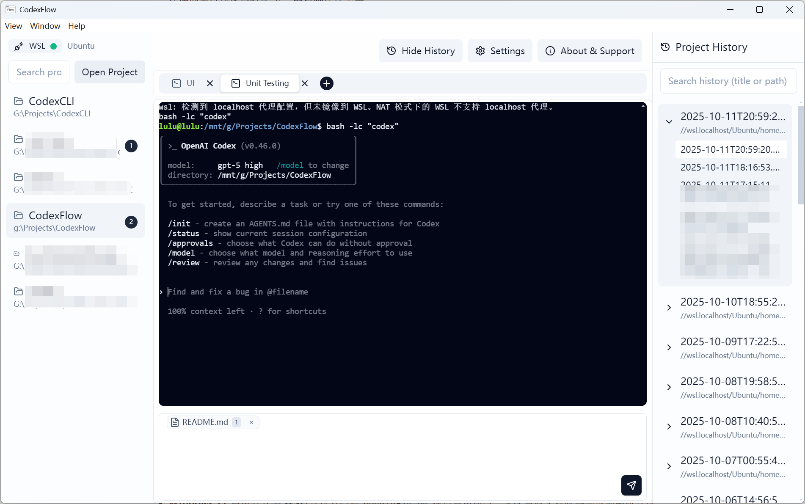
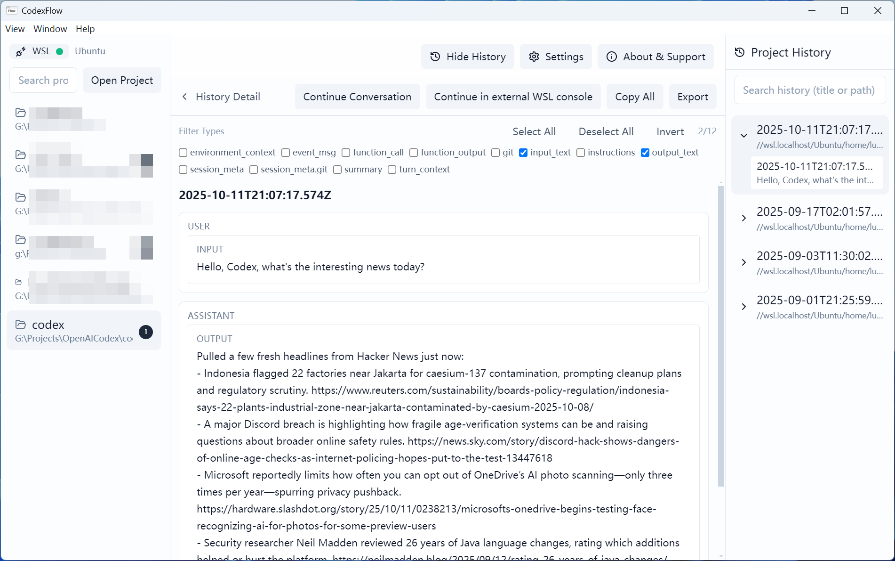
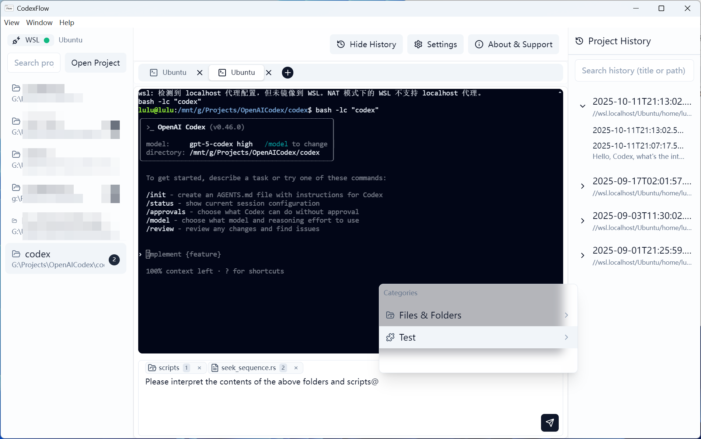
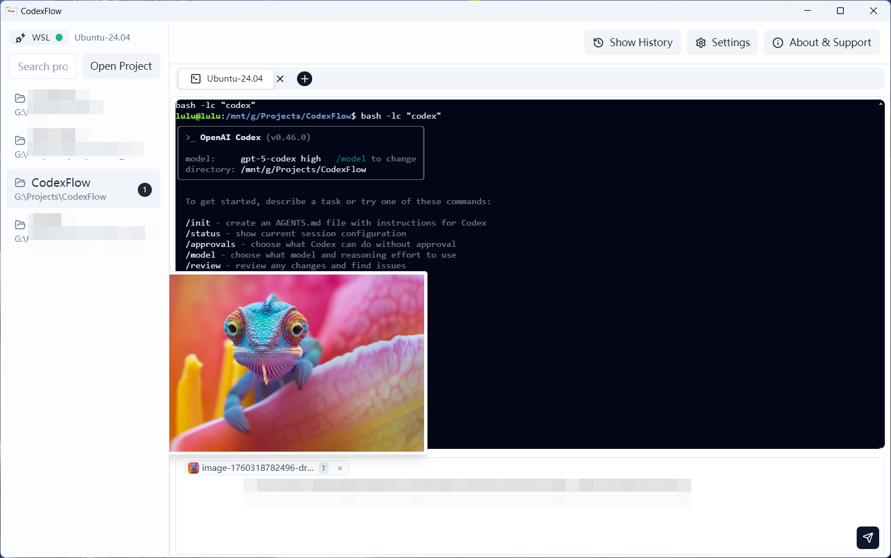
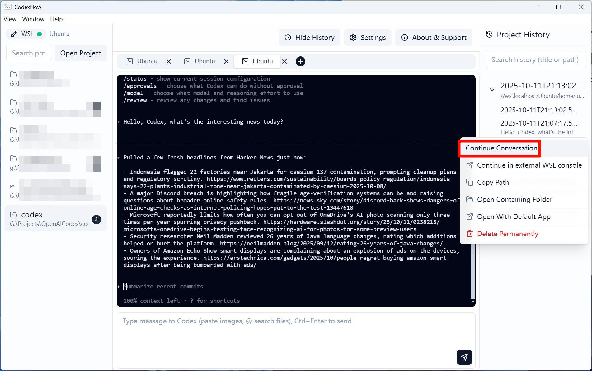

<div align="center">
<br/>

<!-- Badges -->
<a href="https://github.com/lulu-sk/CodexFlow/stargazers"></a>
<a href="https://github.com/lulu-sk/CodexFlow/releases"></a>


<a href="./LICENSE"></a>

</div>

<br/>

| English | [简体中文](./README.zh-CN.md) |
| --- | --- |

# CodexFlow

> The unified workspace built for **Codex CLI**: organize and switch sessions by **project**, browse history elegantly, enrich prompts with **pasted images / dragged files / @project files**, and relaunch past conversations in one click for a smoother Codex experience.

- Platform recommendation: **Windows 11 + WSL (default distro Ubuntu‑24.04)**. The best experience appears when Codex runs inside WSL. **PowerShell mode is experimental** (usable but not suggested as default).
- Project architecture: **UI host with a minimal terminal bridge** (Electron + React + Vite + node‑pty + xterm).

---

## Contents

- [Key Features](#-key-features)
- [Interface Overview](#-interface-overview)
- [Quick Start](#-quick-start)
- [Tips](#-tips)
- [Development & Build](#-development--build)
- [Internationalization (i18n)](#-internationalization-i18n)
- [Directory Overview](#-directory-overview)
- [Runtime Notes & Indexes](#-runtime-notes--indexes)
- [Verification Checklist](#-verification-checklist)
- [Security & Paths](#-security--paths)
- [Remote About/Donate/Announcement/Update Config](#-remote-aboutdonateannouncementupdate-config-optional)
- [Diagnostics & Logs](#-diagnostics--logs)
- [Community & Contributions](#-community--contributions)
- [License](#-license)
- [Resources & Conventions](#-resources--conventions-copy-ready)

---

## ✨ Key Features

1. **Automatic history ingestion & grouping (WSL / PowerShell)**
   Read-only index of `~/.codex/sessions/**.jsonl`, grouped by project directories with zero-intrusion management.

2. **Project tabs with one-click creation**
   Create tabs like a browser; hit **+** to open a fresh Codex session and rename tabs as you wish.

3. **Rich graphical input panel**
   The input accepts **pasted images**, **@project files**, and **dragged files** for efficient prompt assembly.

4. **History preview, filtering, and copy**
   Search and filter any conversation, then copy the raw content instantly.

5. **Resume past conversations**
   Continue both **new** and **legacy** Codex CLI sessions even if the official CLI dropped historical resume support.

6. **Parallel projects**
   Display active sessions per project to keep multi-tasking organized.

---

## 🖼️ Interface Overview

| Scenario | Screenshot |
| --- | --- |
| Project overview (tabs + history panel) |  |
| History search & preview |  |
| Rich input (paste images / drag files / @file) |  |
| Pasted image inline preview |  |
| Resume historical sessions |  |

---

## 🚀 Quick Start

### Environment Preparation
- **Windows 11** with **WSL** installed (default distro `Ubuntu-24.04`, configurable; the app falls back to the system default if the preferred distro is unavailable).
- **Codex CLI** must be runnable inside WSL (e.g., `codex` / `codex .`) with successful conversation tests.
- Choose **WSL terminal mode** for the first run; **PowerShell mode is experimental**.

### Environment Preparation Tutorials
- [Install WSL (Ubuntu) on Windows and set up Codex CLI inside WSL](./docs/setup-wsl-codex.en.md)

### Installation
- When releases are available, download the latest installer from **[Releases](https://github.com/lulu-sk/CodexFlow/releases)**.
- If no release is published yet, follow “Development & Build” to package it locally.

### First Run
1. Open **Settings** (gear icon) and configure the execution environment: choose **WSL** or **PowerShell**, pick the correct WSL distro, then save.
2. Select (or add) a project directory and click **+** to create a session.
3. In the Codex terminal, sign in or use your API credentials, type `/`, and complete the initial model and approval policy setup as needed.
4. Paste images, @project files, or drag files into the input box and start collaborating.

---

## 🧪 Tips
- **Resume history**: Pick any conversation from the list and hit “Continue” to extend the context.
- **Filter & copy**: Filter the timeline and copy the content you need.
- **Input booster**: Pasted images appear inline as previews; referenced files stay discoverable.
- **Multi-project switching**: The sidebar shows active session counts per project to keep workloads balanced.

---

## 🛠️ Development & Build

### Development Environment
- Node.js ≥ 18
- WSL installed with an available distro (default `Ubuntu-24.04`)

### Start Development
```bash
# Install dependencies (compiles Electron main process and rebuilds native modules)
npm i

# Launch Vite (web) and Electron (main process) together
npm run dev
# During development the main process loads from DEV_SERVER_URL=http://localhost:5173
```

### Production Build

```bash
# Equivalent to: npm run build:web && electron-builder
npm run build
```

* Before packaging, `postinstall` compiles the main process to `dist/electron` and rebuilds native modules (e.g., `node-pty`).  
* On Windows you can run `build-release.bat` (`skip-install` skips reinstalling dependencies).  
* If source files under `/electron/*` change, rerun `npm i` or `npx tsc -p tsconfig.json` to refresh `dist/electron`. For ABI mismatches (e.g., `node-pty`), run `npm run postinstall`.

### Common Scripts

```bash
npm run test        # Run unit tests with Vitest
npm run i18n:report # Diff localized keys against the English baseline
npm run i18n:check  # Strict key checking used in CI
```

---

## 🌐 Internationalization (i18n)

* Stack: **i18next + react-i18next + ICU**. Namespaces are separated by module: `common`, `settings`, `projects`, `terminal`, `history`, `at`.
* Sample usage inside components:

```ts
import { useTranslation } from 'react-i18next';
const { t } = useTranslation('settings');
t('settings:language.label');
```
* Resource directory: `web/src/locales/<lng>/<namespace>.json`
* Switch language: In the settings page or via DevTools `await window.host.i18n.setLocale('zh')`

### Scanning & Validation

```bash
# Report key differences against the English baseline
npm run i18n:report

# Strict missing-key check (used in CI)
npm run i18n:check
```

* Use `BASE_LNG=xx` to set the reference language (defaults to `en`).  
* Missing keys fall back to `en`. Rendering never returns null or empty strings (`returnNull/returnEmptyString=false`).

### External Language Packs (no code changes needed)

* Windows: `%APPDATA%/codexflow/locales/<lng>/<namespace>.json`  
  Example: `C:\Users\you\AppData\Roaming\codexflow\locales\ja\common.json`
* WSL: `/mnt/c/Users/you/AppData/Roaming/codexflow/locales/ja/common.json`

> The language dropdown merges built-in locales with user-provided ones; user files take precedence for local overrides.

---

## 📁 Directory Overview

```
/electron/main.ts
/electron/preload.ts
/electron/pty.ts
/electron/wsl.ts          # Windows/WSL path & distro utilities
/electron/i18n.ts         # Main-process locale state and IPC bridge
/electron/history.ts      # History reader (JSONL)
/electron/indexer.ts      # Incremental indexer with caching & watchers
/electron/fileIndex.ts    # File/directory indexer (ripgrep + chokidar)
/electron/projects/
  index.ts                # Unified entry point (defaults to fast implementation)
/web/
  index.html
  src/
    App.tsx
    main.tsx
    index.css
    i18n/setup.ts
    adapters/TerminalAdapter.tsx
    components/ui/*
    lib/*
    types/host.d.ts
    vite.config.ts
/tailwind.config.js
/postcss.config.js
/package.json
/tsconfig.json
/.gitignore
/docs/
  i18n.md
  diagnostics.md
```

---

## ⚙️ Runtime Notes & Indexes

* Default distro: `distro = 'Ubuntu-24.04'`
* Terminal modes: `terminal = 'wsl' | 'windows'` (PowerShell)
* Launch command: stores base `codexCmd = 'codex'`; no tmux wrapping in the current implementation

* WSL: `bash -lc "<codexCmd>"`
* Windows: executed directly inside PowerShell
* Example project path: `wslPath = '/mnt/c/Users/you/code/demo'`
* History indexing: `electron/indexer.ts` indexes `~/.codex/sessions/**.jsonl` incrementally and writes a local cache; the renderer consumes it via IPC.
* File indexing: `electron/fileIndex.ts` runs **ripgrep** for the initial scan and **chokidar** for updates (place ripgrep at `vendor/bin/rg.exe` when running on Windows).
* Projects module: unified entry `electron/projects/index.ts`, default implementation `projects.fast.ts`. The chosen implementation is logged to `perf.log`.

---

## ✅ Verification Checklist

1. Launch the app and click "New Agent": the WSL prompt/command output should appear.
2. Type `uname -a` and `pwd` in the input box and press Enter: expect echoed results.
3. Resize the window: the terminal content should auto-fit (FitAddon active).
4. Optional: start `vim`, ensure it works, and exit cleanly.
5. Optional: if `codex` is installed, run `codex .` to confirm it launches and streams logs.

---

## 🔐 Security & Paths

* Renderer hardening: `contextIsolation: true`, `nodeIntegration: false`. All capabilities are exposed via the minimal API in `electron/preload.ts` (types in `web/src/types/host.d.ts`).
* Windows/WSL path conversion: see `electron/wsl.ts`, supporting both drive letters and `\\wsl.localhost\Distro\...` ↔ WSL paths.

---

## 📢 Remote About/Donate/Announcement/Update Config (Optional)

* Deploy `docs/about-remote.json` to a fixed endpoint; by default the app reads `DEFAULT_REMOTE_URL` defined in `web/src/lib/about.ts` (replace as needed).
* Responses are cached and refreshed opportunistically when the network is available.

---

## 🩺 Diagnostics & Logs

* Refer to `docs/diagnostics.md` for detailed guidance.

* Main process: set `CODEX_DIAG_LOG=1` to write `%APPDATA%/codexflow/perf.log`
* Renderer: run `localStorage.setItem('CF_DIAG_LOG','1')`

---

## 🤝 Community & Contributions

* 💬 Q&A / Discussions: GitHub Discussions
* 🐞 Bugs / Feature requests: GitHub Issues (include system info, reproduction steps, and use the templates)
* 🤲 Contribution guide: see `CONTRIBUTING.md` or `CONTRIBUTING.zh-CN.md`
* 🔐 Security issues: follow `SECURITY.md` (avoid disclosing in public issues)
* 🔏 Privacy policy: see `PRIVACY.md`

Star ⭐ the project, send PRs, and help localize new languages!

---

## 📄 License

Released under **Apache License 2.0**. See `LICENSE` in the repository root. Retain additional notices listed in `NOTICE` when redistributing.

---

## 🧾 Resources & Conventions (Copy Ready)

- Application screenshots: `assets/screenshots/<lng>/<name>.png` (`lng` accepts `en` or `zh`).
- Branding: always refer to the app as **CodexFlow** without abbreviations.
- Reference links:
  - Repository: https://github.com/lulu-sk/CodexFlow
  - Releases: https://github.com/lulu-sk/CodexFlow/releases
