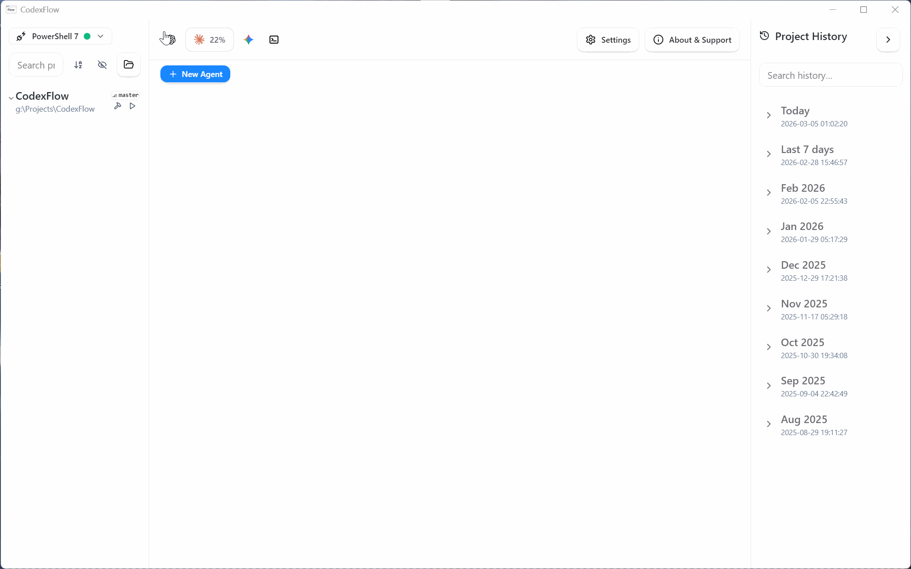
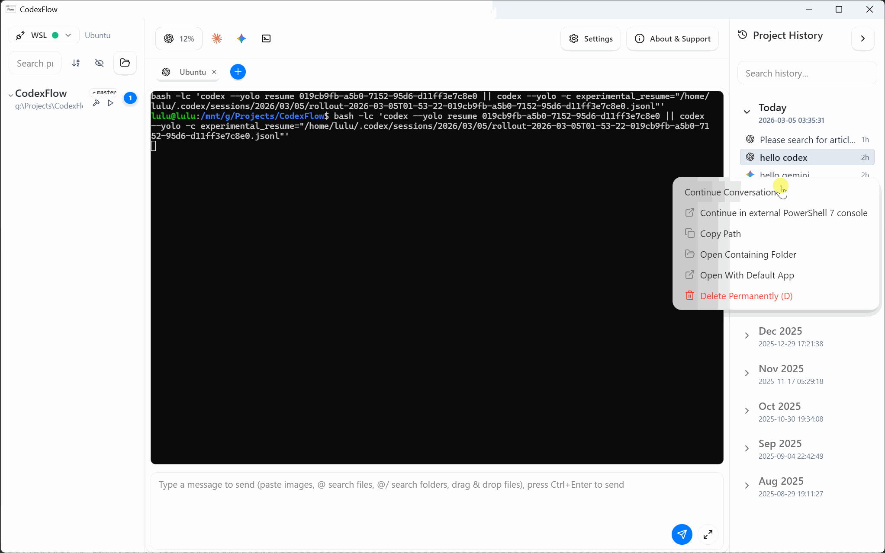
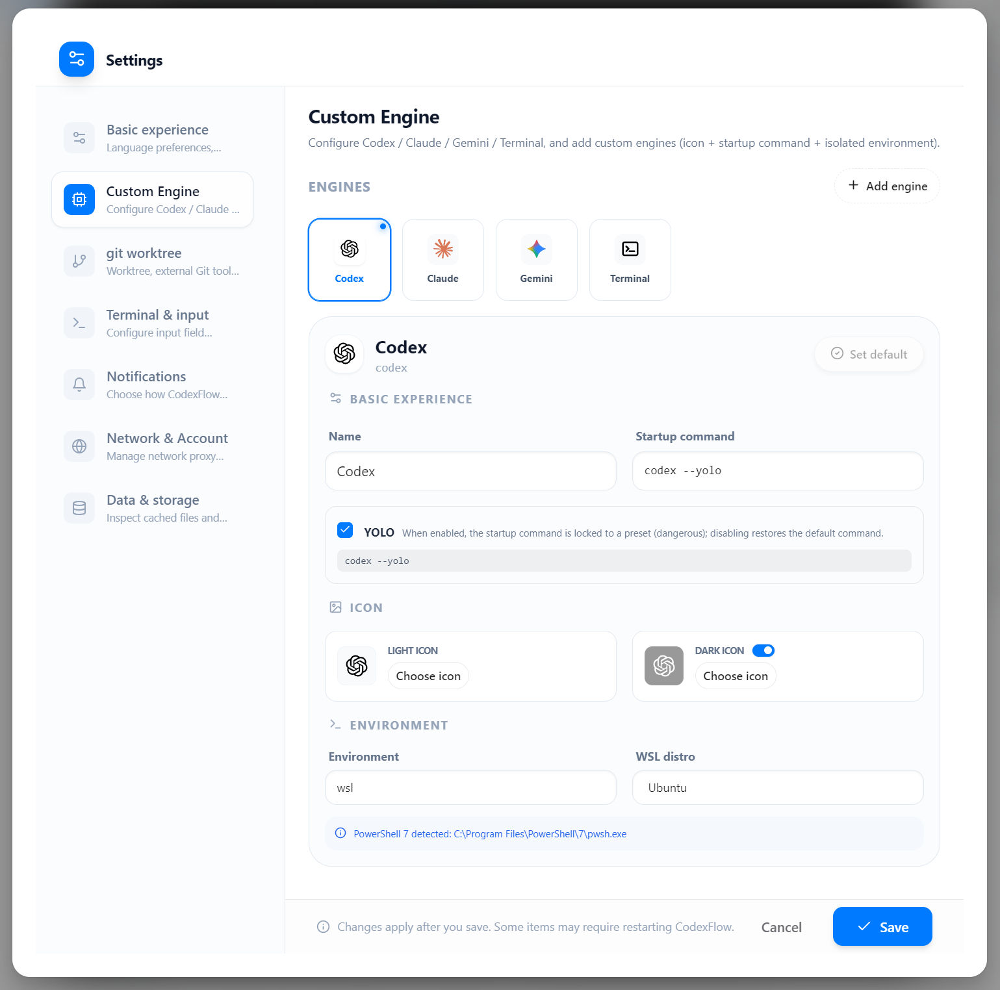

<div align="center">
<br/>

<!-- Badges -->
<a href="https://github.com/lulu-sk/CodexFlow/stargazers"></a>
<a href="https://github.com/lulu-sk/CodexFlow/releases"></a>


<a href="./LICENSE"></a>

</div>

<br/>

| English | [简体中文](./README.zh-CN.md) |
| --- | --- |

# CodexFlow

> A "Unified Workbench" crafted for **AI Coding Agents** — switch between **Codex / Claude / Gemini** (and custom engines) in one click, organize sessions and history by **project directories**, run parallel tasks with **Git Worktree**, browse and resume conversations with Markdown rendering, and provide a graphical input box for CLI with support for **pasting images / dragging files / @project files / full-screen input** for efficient prompting.

- **Platform Recommendation**: **Windows 11 + WSL (Default Distro: Ubuntu-24.04)**; provides the best experience when WSL is installed and engines are available within it. **PowerShell Mode** (PS5 / PS7 / CMD) is also fully supported.
- **Project Structure**: **UI Host with a Minimal Terminal Bridge** (Electron + React + Vite + node-pty + xterm).

---

## Table of Contents

- [Core Features](#-core-features)
- [Interface Overview](#-interface-overview)
- [Quick Start](#-quick-start)
- [Usage Tips](#-usage-tips)
- [Development & Build](#-development--build)
- [Internationalization (i18n)](#-internationalization-i18n)
- [Directory Structure (Summary)](#-directory-structure-summary)
- [Runtime Notes & Indexes](#-runtime-notes--indexes)
- [Verification Steps](#-verification-steps-recommended-self-check)
- [Security & Paths](#-security--paths)
- [Diagnostics & Logs](#-diagnostics--logs)
- [Community & Contributions](#-community--contributions)
- [License](#-license)
- [Resources & Conventions](#-resources--conventions-copy-ready)

---

## ✨ Core Features

1. **Unified Multi-Engine Workbench (Codex / Claude / Gemini / Terminal + Custom)**
   Switch engines instantly via the top bar. Built-in engines support **usage monitoring** and **completion notifications** (taskbar badges/system notifications/alert sounds). Each engine can be independently configured with **startup commands**, **light/dark icons**, and **execution environments** (WSL / Windows / Windows PowerShell / PowerShell 7 / specific WSL distro), with support for custom engine extensions.
2. **Cross-Engine History Center**
   Read-only incremental indexing of native session records across multiple engines (Codex / Claude / Gemini) with full support for both Windows and WSL paths. Sessions are aggregated by project directory with one-click creation of new sessions. Features include filtering, quick search, and time-grouped previews. The detail view supports **Markdown rendering** (with syntax highlighting) and **in-page search highlighting** for efficient history lookups.
3. **Native Git Worktree Parallel Workflow (Designed for Parallel Agents, Recommended)**
   Create or reuse worktrees directly from branches (branch badge `⎇`). Supports **single or hybrid parallel workflows** across multiple engines (Codex / Claude / Gemini) with a concurrent progress panel, cancellation, and rollback cleanup. Provides a seamless loop of "Create → Run → Merge → Clean" after task completion.
4. **GUI Input for CLI: @Files / @Rules / Images / Drag-and-Drop**
   The input box supports **pasting images (with inline previews)**, dragging files/directories, and `@` quick selection for project files/directories. **AGENTS.md / CLAUDE.md / GEMINI.md** can be quickly edited and referenced. Supports full-screen expansion for crafting long and complex prompts.
5. **One-Click Resume for History Sessions**
   Compatible with various CLI resume strategies; handles WSL/Windows path differences gracefully. Allows resuming conversations within the app or in an external console with one click.
6. **Engine Completion Notifications**
   Integrated system notifications, alert sounds, and taskbar badges with project-level navigation. When an engine finishes its task, you can jump directly back to the corresponding project and tab, ensuring you never miss a completion message.
7. **Usage & Account Management**
   Real-time monitoring of quotas and usage for each engine in the top bar. Supports multi-account configuration and quick switching (independent management of history and sessions per engine).
8. **Polished Experience & Deep Customization**
   Supports Light/Dark/System-matching themes. Customizable terminal fonts, themes, scrollbars, and overall appearance. Project management includes sorting, hiding, drag-and-drop grouping, and custom nicknames. Full network proxy support is also included.

------

## 🖼️ Interface Overview

### 1) Overview (Engine Switcher + Project Tabs + History Entry)


### 2) Git Worktree Workflow (Create / Parallel / Merge & Recycle)


### 3) History Center (Pagination + Markdown Rendering + Search Highlighting)


### 4) One-Click Resume + Input Enhancement (@Files/@Rules + Drag + Paste Image)


### 5) Settings & Engines (Custom Engines, Icons, Execution Environment)


---

## 🚀 Quick Start

### Environment Preparation
- **Windows 11** with **WSL** installed (Default distro `Ubuntu-24.04`, configurable in settings; falls back to system default if specified distro is invalid).
- At least one AI Programming Agent CLI runnable in WSL or PowerShell (e.g., `codex`, `claude`, or `gemini`).
- For `codex`, **WSL Terminal Mode** is recommended; **PowerShell Mode** (PS5 / PS7) is also available.

### Setup Tutorials
- [Install WSL (Ubuntu) and Codex CLI on Windows](./docs/setup-wsl-codex.en.md)

### Installation
- If a release version is available, download the latest installer from **[Releases](https://github.com/lulu-sk/CodexFlow/releases)**.
- Otherwise, follow the "Development & Build" section below to package it locally.

### First-Time Use
1. Click the **Settings** (gear icon) in the top right to configure the environment: Select **WSL / PowerShell**, specify the correct WSL distro, and save.
2. Choose your desired engine from the top bar (Codex / Claude / Gemini / Terminal / Custom).
3. Select (or add) a project directory and click **+** to start a new session.
4. Log in or provide API credentials in the terminal as required.
5. Paste images, use `@` for project files or rules, drag files in, and start your collaborative coding journey.

---

## 🧪 Usage Tips
- **One-Click Resume**: Select any conversation from the history list and click "Continue" to pick up where you left off — supported across all engines.
- **Filter & Copy History**: Supports filtering and direct copying of rendered content; Markdown rendering makes history easy to read.
- **Input Boosters**: Pasted images automatically show inline previews; use full-screen mode for composing long prompts.
- **Worktree Workflow**: Create worktrees from the project sidebar to run agents in parallel, then merge results back to the base branch.
- **Multi-Project Management**: The left sidebar shows active session counts, helping you keep track of multiple tasks.
- **Multiple Instances (Profiles)**: Enable "Experimental Features" in settings (requires restart) to open multiple application instances. For a persistent profile, use `--profile <name>` (e.g., `CodexFlow.exe --profile work`).
- **Keyboard Shortcuts**: Hover over list items to see available shortcuts; dialogs support keyboard navigation.

---

## 🛠️ Development & Build

### Development Environment
- Node.js ≥ 18
- WSL installed with an available distro (Default: `Ubuntu-24.04`)

### Start Development
```bash
# Install dependencies (compiles Electron main process and rebuilds native modules)
npm i

# Launch Vite (web) and Electron (main process) concurrently
npm run dev
# During development, the main process loads from DEV_SERVER_URL=http://localhost:5173
```

### Production Build
```bash
# Equivalent to: npm run build:web && electron-builder
npm run build
```

* The `postinstall` script compiles the main process to `dist/electron` and rebuilds native modules (like `node-pty`) before packaging.
* On Windows, you can run `build-release.bat` (passing `skip-install` to skip reinstalling dependencies).
* If you modify `/electron/*` source code, rerun `npm i` or manually run `npx tsc -p tsconfig.json` to refresh `dist/electron`. If `node-pty` reports an ABI mismatch, run `npm run postinstall` to rebuild native dependencies.

### Common Scripts
```bash
npm run test        # Run unit tests with Vitest
npm run i18n:report # Check key differences against the English baseline
npm run i18n:check  # Strict key validation used in CI
```

---

## 🌐 Internationalization (i18n)

* Tech Stack: **i18next + react-i18next + ICU**; namespaces are split by module: `common`, `settings`, `projects`, `terminal`, `history`, `at`.
* Component Usage Example:
```ts
import { useTranslation } from 'react-i18next'
const { t } = useTranslation('settings')
t('settings:language.label')
```
* Resource Directory: `web/src/locales/<lng>/<namespace>.json`
* Switch Language: Settings page → "Interface Language", or via DevTools: `await window.host.i18n.setLocale('zh')`

### Scanning & Validation
```bash
# Report key differences against the English baseline (en)
npm run i18n:report

# Strict check for missing keys (used in CI)
npm run i18n:check
```
* Set the baseline language via the `BASE_LNG=xx` environment variable (defaults to `en`).
* Missing keys fall back to `en`, avoiding empty string rendering (`returnNull/returnEmptyString=false`).

### External Language Packs (Customizable without code changes)
* **Windows**: `%APPDATA%/codexflow/locales/<lng>/<namespace>.json`
  Example: `C:\Users\you\AppData\Roaming\codexflow\locales\ja\common.json`
* **WSL**: `/mnt/c/Users/you/AppData/Roaming/codexflow/locales/ja/common.json`
> The settings page language list automatically merges "built-in locales" with "user directory locales"; user directory files have higher priority for local overrides.

---

## 📁 Directory Structure (Summary)

```
/electron/
  main.ts
  preload.ts
  pty.ts
  wsl.ts                        # Windows/WSL path & distro utilities
  i18n.ts                       # Main process language state & IPC bridge
  history.ts                    # History reader (JSONL)
  indexer.ts                    # History indexer (incremental cache + watchers)
  fileIndex.ts                  # File/Directory index (ripgrep + chokidar)
  notifications.ts              # System notification management
  storage.ts                    # App data & cache management
  debugConfig.ts                # Unified debug config (debug.config.jsonc)
  security/
    rendererHeaders.ts          # CSP & Security response headers
  git/
    exec.ts                     # Git command execution wrapper
    worktreeOps.ts              # Worktree create/recycle/delete
    worktreeCreateTasks.ts      # Concurrent creation tasks
    worktreeRecycleTasks.ts     # Merge & recycle tasks
    worktreeStateSnapshot.ts    # Transactional state snapshots
  codex/
    bridge.ts                   # Codex CLI bridge (auth, usage, rate limits)
    authBackups.ts              # Multi-account backup & switching
    config.ts                   # Codex config.toml management
  agentSessions/
    claude/                     # Claude session discovery & parsing
    gemini/                     # Gemini session discovery & parsing
  providers/
    runtime.ts                  # Engine runtime resolution
  projects/
    index.ts                    # Unified entry point (default fast implementation)
  stores/
    dirTreeStore.ts             # Directory tree persistence
    worktreeMetaStore.ts        # Worktree metadata persistence
    buildRunStore.ts            # Build/Run config persistence
/web/
  index.html
  src/
    App.tsx
    main.tsx
    index.css
    boot/theme-bootstrap.ts     # Theme pre-loading (prevents flickering)
    i18n/setup.ts
    adapters/TerminalAdapter.tsx
    features/
      settings/settings-dialog.tsx
      history/
        renderers/history-markdown.tsx   # Markdown + Shiki rendering
        find/history-find.ts             # In-page search highlighting
    components/
      topbar/
        provider-switcher.tsx            # Engine switcher
        codex-status.tsx                 # Codex usage panel
        claude-status.tsx                # Claude usage panel
        gemini-status.tsx                # Gemini usage panel
      ui/*
    lib/
      providers/                # Engine definitions & YOLO presets
      theme.ts                  # Theme management
      font-utils.ts             # Font enumeration & detection
      engine-rules.ts           # Rule file path resolution
      shell.ts                  # Shell command builder
      dir-tree-dnd.ts           # Directory tree drag-and-drop sorting
    providers/
      codex/commands.ts
      claude/commands.ts
      gemini/commands.ts
    types/host.d.ts
    vite.config.mts
/tailwind.config.js
/postcss.config.js
/package.json
/tsconfig.json
/.gitignore
/docs/
  i18n.md
  diagnostics.md
```

---

## ⚙️ Runtime Notes & Indexes

* **Default Distro**: `distro = 'Ubuntu-24.04'`
* **Terminal Mode**: `terminal = 'wsl' | 'windows' | 'pwsh'` (PowerShell 5 / PowerShell 7 / CMD auto-detected)
* **Engine Commands**: Each engine independently stores its startup command (e.g., `codex`, `claude`, `gemini`), with optional YOLO presets.
* **Execution**:
  * **WSL**: `bash -lc "<engineCmd>"`
  * **Windows**: Executed within PowerShell (or pwsh / cmd).
* **Project Path Example**: `wslPath = '/mnt/c/Users/you/code/demo'`
* **History Indexing**: `electron/indexer.ts` performs background incremental indexing of all engine sessions and writes to a local cache; accessible via IPC with support for paginated loading.
* **File Indexing**: `electron/fileIndex.ts` uses **ripgrep** for initial full scans and **chokidar** for incremental updates (recommended to place ripgrep in `vendor/bin/rg.exe`). Search is performed in the main process to avoid UI lag.
* **Git Worktree**: `electron/git/worktreeOps.ts` manages the worktree lifecycle using transactional state snapshots. Metadata is stored in `electron/stores/worktreeMetaStore.ts`.
* **Projects Module**: Unified entry point via `electron/projects/index.ts`, defaulting to the `projects.fast.ts` implementation; the active implementation is logged in `perf.log` at startup.

---

## ✅ Verification Steps (Recommended Self-Check)

1. Open the app and click "New Agent": Verify the WSL prompt or command output appears.
2. Type `uname -a` or `pwd` in the input box and press Enter: Verify expected echo back.
3. Window Scaling: Verify terminal content automatically fits the window (FitAddon active).
4. Switch Engines: Select different engines from the top bar and verify new sessions start correctly.
5. (Optional) Create a worktree from the sidebar and verify the agent starts in the new worktree directory.
6. (Optional) If `codex` is installed, run `codex .` and verify it starts and outputs logs.

---

## 🔐 Security & Paths

* **Renderer Security**: `contextIsolation: true`, `nodeIntegration: false`; all capabilities exposed via a minimal API in `electron/preload.ts` (Type definitions in `web/src/types/host.d.ts`).
* **Content Security Policy (CSP)**: Strict resource loading policies enforced via both meta tags and response headers (`electron/security/rendererHeaders.ts`), including `frame-ancestors 'none'` and `X-Frame-Options: DENY`.
* **Path Conversion**: See `electron/wsl.ts` for conversion between Windows drive letters/`\\wsl.localhost\Distro\...` and WSL paths.

---

## 🩺 Diagnostics & Logs

* See `docs/diagnostics.md` for details.
* **Unified Debug Config**: Place `debug.config.jsonc` in the app data directory to enable per-module diagnostics.
* **Main Process**: Set environment variable `CODEX_DIAG_LOG=1` to write logs to `%APPDATA%/codexflow/perf.log`.
* **Renderer**: Run `localStorage.setItem('CF_DIAG_LOG','1')` in the console.

---

## 🤝 Community & Contributions

* 💬 **Q&A / Discussions**: GitHub Discussions
* 🐞 **Bugs / Feature Requests**: GitHub Issues (please use the template and include system info/reproduction steps)
* 🤲 **Contribution Workflow**: See `CONTRIBUTING.md` or `CONTRIBUTING.zh-CN.md`
* 🔐 **Security Issues**: See `SECURITY.md` (do not disclose in public issues)
* 🔏 **Privacy Policy**: See `PRIVACY.md`

Stars ⭐, Pull Requests, and Language Pack translations are all welcome.

---

## 📄 License

This project is open-source under the **Apache License 2.0**. See the `LICENSE` file for details. For redistribution, please retain the additional notices in the `NOTICE` file.

---

## 🧾 Resources & Conventions (Copy Ready)

- **App Screenshots**: `assets/screenshots/<feature-name>.(gif|png)`
- **Branding**: Always use **CodexFlow**; do not abbreviate.
- **Reference Links**:
  - Repository: https://github.com/lulu-sk/CodexFlow
  - Releases: https://github.com/lulu-sk/CodexFlow/releases
