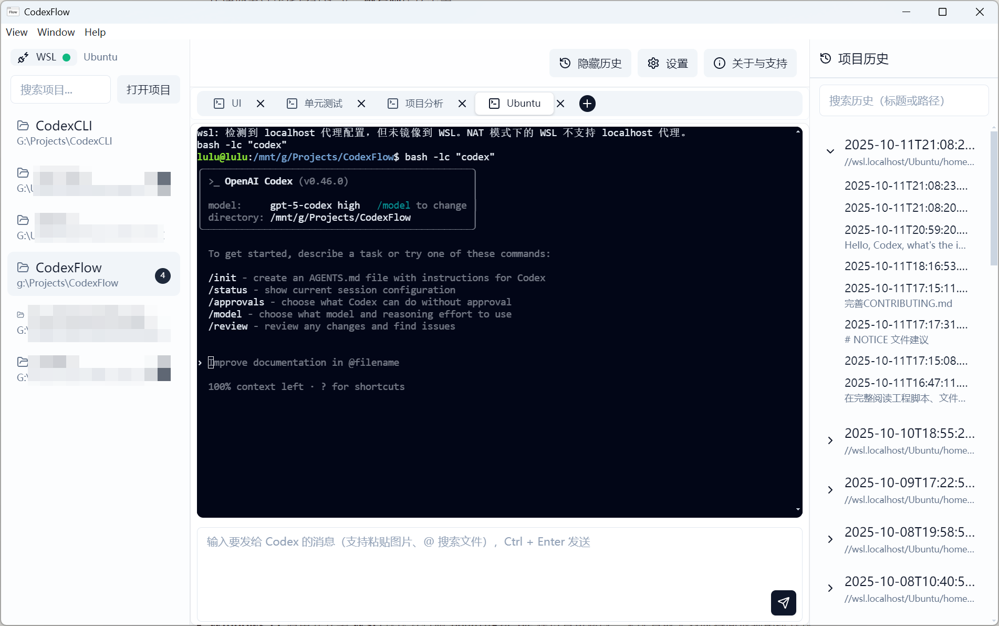
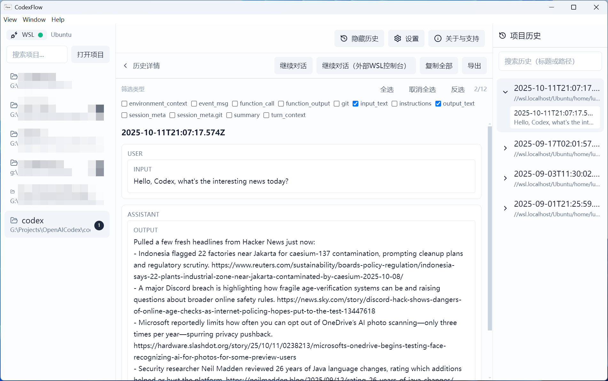
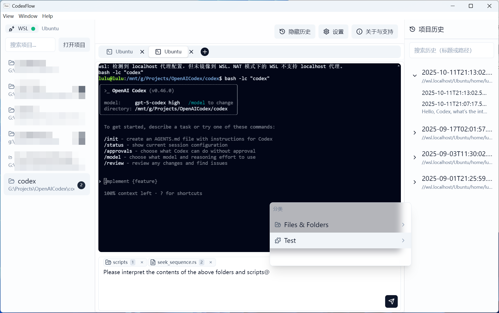
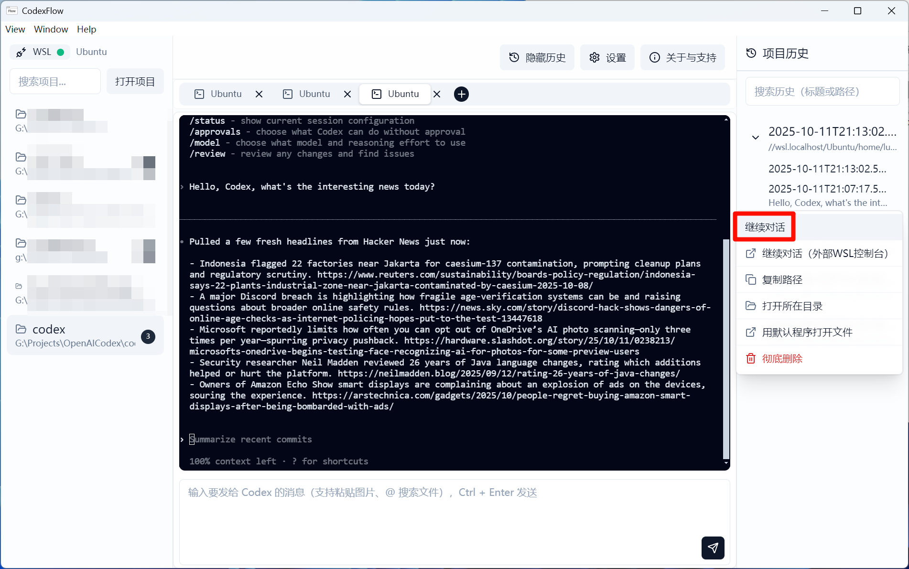

<div align="center">
<br/>

<!-- Badges -->
<a href="https://github.com/lulu-sk/CodexFlow/stargazers"></a>
<a href="https://github.com/lulu-sk/CodexFlow/releases"></a>
<a href="https://github.com/lulu-sk/CodexFlow/releases"></a>


<a href="./LICENSE"></a>

</div>

<br/>

| 简体中文 | [English](./README.md) |
| --- | --- |

# CodexFlow

> 为 **Codex CLI** 打造的“统一工作台”：按**项目**组织与切换会话,优雅浏览历史；具备**粘贴图片 / 拖拽文件 / @项目文件**的图形输入框；一键新建并继续会话,让你的 Codex 使用流畅高效。

- 平台建议：**Windows 11 + WSL(默认发行版 Ubuntu‑24.04)**；已装 WSL 且 Codex 在 WSL 可用时体验最佳。**PowerShell 模式为实验性**(可用但不建议作为默认)。
- 项目结构：**UI 宿主与最小终端桥接**(Electron + React + Vite + node‑pty + xterm)。

---

## 目录

- [核心特性](#-核心特性)
- [界面一览](#-界面一览)
- [快速开始](#-快速开始)
- [使用小贴士](#-使用小贴士)
- [开发与构建](#-开发与构建)
- [多语言(i18n)](#-多语言i18n)
- [目录结构(摘要)](#-目录结构摘要)
- [运行时要点与索引](#-运行时要点与索引)
- [验证步骤](#-验证步骤建议自检)
- [安全与路径](#-安全与路径)
- [远端「关于/捐赠/公告/更新」配置](#-远端关于捐赠公告更新配置可选)
- [诊断与日志](#-诊断与日志)
- [交流与贡献](#-交流与贡献)
- [许可证](#-许可证)
- [资源与约定](#-资源与约定可直接复制)

---

## ✨ 核心特性

1. **历史自动读取与分组(WSL / PowerShell)**
   只读索引 `~/.codex/sessions/**.jsonl`,按“项目目录”聚合展示,零侵入管理历史。

2. **“项目标签页”与一键新建**
   像浏览器一样为项目开标签；点击 **+** 即可开启新的 Codex 会话,标签可自定义命名。

3. **图形输入增强**
   输入框支持**粘贴图片**、**@项目文件**与**拖拽文件**,显著提升输入效率与上下文组织能力。

4. **历史预览、筛选与复制**
   快速搜索过滤任何对话,并**一键复制**原始内容。

5. **继续历史对话**
   Codex CLI 新版不支持继续早期对话？CodexFlow 同时支持**新对话**与**早期对话一键继续**。

6. **多项目并行**
   清晰呈现各项目活跃会话与状态,切换成本低,多任务节奏更稳。

---

## 🖼️ 界面一览

| 场景 | 截图 |
| --- | --- |
| 项目概览(标签页 + 历史面板) |  |
| 历史检索与预览 |  |
| 图形输入框(粘贴图片 / 拖拽 / @文件) |  |
| 一键继续历史对话 |  |

---

## 🚀 快速开始

### 环境准备
- **Windows 11**,启用并安装 **WSL**(默认发行版 `Ubuntu-24.04`,在设置可修改；未配置或无效时将回退到系统默认 WSL 发行版)。
- **Codex CLI** 已在 WSL 内可直接运行(如 `codex` / `codex .`)并测试可进行会话。
- 首次体验建议选择 **WSL 终端模式**；**PowerShell 模式为实验性**。

### 安装
- 若仓库已有发布版本,请前往 **[Releases](https://github.com/lulu-sk/CodexFlow/releases)** 下载最新安装包。
- 若暂无发布,可按下文“开发与构建”在本地打包。

### 初次使用
1. 选择(或添加)一个项目目录,点击 **+** 新建会话。
2. 在开启的终端中执行 `codex` 或 `codex .`,按需设置模型与审批策略。
3. 在图像输入框中粘贴图片、@项目文件、拖拽文件,开始你的对话与协作。

---

## 🧪 使用小贴士
- **历史一键继续**：在历史列表中选中任意对话,点击“继续”以延续上下文。
- **历史筛选与复制**：支持筛选,并可直接复制所见内容。
- **输入增强**：粘贴图片将自动内联为可预览块；文件可直接 @ 引用。
- **多项目切换**：左侧项目区显示活跃会话数,利于多任务掌控。

---

## 🛠️ 开发与构建

### 开发环境
- Node.js ≥ 18
- 已安装 WSL,并具备发行版(默认 `Ubuntu-24.04`)

### 启动开发
```bash
# 安装依赖(会编译 Electron 主进程并重建原生模块)
npm i

# 同时启动 Vite(web)与 Electron(主进程)
npm run dev
# 开发时,主进程会从 DEV_SERVER_URL=http://localhost:5173 加载页面
```

### 生产构建

```bash
# 等价于：npm run build:web && electron-builder
npm run build
```

* 构建前的 `postinstall` 会将主进程编译到 `dist/electron`,并重建原生模块(如 `node-pty`)。
* Windows 可执行 `build-release.bat`(传入 `skip-install` 可跳过重新安装依赖)。
* 若更新了 `/electron/*` 源码,请重新执行 `npm i` 或手动运行 `npx tsc -p tsconfig.json` 以刷新 `dist/electron`；如 `node-pty` 报 ABI 不匹配,可运行 `npm run postinstall` 以重建原生依赖。

### 常用脚本

```bash
npm run test        # 使用 Vitest 执行单元测试
npm run i18n:report # 检查与英文基线的语言键差异
npm run i18n:check  # CI 使用的严格语言键校验
```

---

## 🌐 多语言(i18n)

* 技术栈：**i18next + react‑i18next + ICU**；命名空间按模块拆分：`common`、`settings`、`projects`、`terminal`、`history`、`at`。
* 组件内示例：

```ts
import { useTranslation } from 'react-i18next'
const { t } = useTranslation('settings')
t('settings:language.label')
```
* 资源目录：`web/src/locales/<lng>/<namespace>.json`
* 切换语言：设置页“界面语言”,或在 DevTools 中执行 `await window.host.i18n.setLocale('zh')`

### 扫描与校验

```bash
# 报告与英文基线(en)的键差异
npm run i18n:report

# 严格校验缺失键(CI 使用)
npm run i18n:check
```

* 通过环境变量 `BASE_LNG=xx` 指定基线语言(默认 `en`)。
* 若某键缺失,会回退到 `en`,且避免渲染空字符串(`returnNull/returnEmptyString=false`)。

### 外置语言包(无需改代码亦可自定义)

* Windows：`%APPDATA%/codexflow/locales/<lng>/<namespace>.json`
例：`C:\Users\you\AppData\Roaming\codexflow\locales\ja\common.json`
* WSL：`/mnt/c/Users/you/AppData/Roaming/codexflow/locales/ja/common.json`

> 设置页语言列表会自动合并“打包内语言”与“用户目录语言”；用户目录优先级更高,可用于本地覆盖。

---

## 📁 目录结构(摘要)

```
/electron/main.ts
/electron/preload.ts
/electron/pty.ts
/electron/wsl.ts          # Windows/WSL 路径与发行版工具
/electron/i18n.ts         # 主进程语言状态与 IPC 桥
/electron/history.ts      # 历史读取(JSONL)
/electron/indexer.ts      # 历史索引器(增量缓存 + 监听)
/electron/fileIndex.ts    # 文件/目录索引(ripgrep + chokidar)
/electron/projects/
index.ts                # 统一入口(默认 fast 实现)
/web/
index.html
src/
App.tsx
main.tsx
index.css
i18n/setup.ts
adapters/TerminalAdapter.tsx
components/ui/*
lib/*
types/host.d.ts
vite.config.ts
/tailwind.config.js
/postcss.config.js
/package.json
/tsconfig.json
/.gitignore
/docs/
i18n.md
diagnostics.md
```

---

## ⚙️ 运行时要点与索引

* 发行版默认：`distro = 'Ubuntu-24.04'`
* 终端模式：`terminal = 'wsl' | 'windows'`(PowerShell)
* 启动命令：仅保存基础 `codexCmd = 'codex'`,当前实现不再做 tmux 包装

* WSL：`bash -lc "<codexCmd>"`
* Windows：在 PowerShell 中直接执行
* 项目路径示例：`wslPath = '/mnt/c/Users/you/code/demo'`
* 历史索引：`electron/indexer.ts` 后台增量索引 `~/.codex/sessions/**.jsonl` 并写入本地缓存；渲染端经 IPC 访问
* 文件索引：`electron/fileIndex.ts` 使用 **ripgrep** 进行初次全量扫描,配合 **chokidar** 增量更新(建议将 ripgrep 放至 `vendor/bin/rg.exe`)
* Projects 模块：统一入口 `electron/projects/index.ts`,默认 `projects.fast.ts` 实现；启动时会在 `perf.log` 记录所用实现

---

## ✅ 验证步骤(建议自检)

1. 打开应用后点击“新建控制台”：看到 WSL 提示/命令行输出
2. 在输入框键入 `uname -a`、`pwd` 并回车：应有回显
3. 窗口缩放：终端内容自动铺满(FitAddon 生效)
4. 可选：输入 `vim` 进入并正常退出
5. 可选：若已安装 `codex`,执行 `codex .` 应能启动并输出日志

---

## 🔐 安全与路径

* 渲染进程安全：`contextIsolation: true`、`nodeIntegration: false`；所有能力经 `electron/preload.ts` 暴露的最小 API(类型定义见 `web/src/types/host.d.ts`)
* Windows/WSL 路径互转：见 `electron/wsl.ts`,支持 Windows 盘符与 `\\wsl.localhost\Distro\...` ↔ WSL 路径

---

## 📢 远端「关于/捐赠/公告/更新」配置(可选)

* 可基于 `docs/about-remote.json` 部署到固定地址；默认读取 `web/src/lib/about.ts` 中的 `DEFAULT_REMOTE_URL`(可按需替换)
* 应用会缓存,并在网络可用时刷新

---

## 🩺 诊断与日志

* 详见 `docs/diagnostics.md`

* 主进程：设置环境变量 `CODEX_DIAG_LOG=1` 后写入 `%APPDATA%/codexflow/perf.log`
* 渲染端：`localStorage.setItem('CF_DIAG_LOG','1')`

---

## 🤝 交流与贡献

* 💬 Q&A / 讨论：GitHub Discussions
* 🐞 Bug / 功能请求：GitHub Issues(请附带系统信息与复现步骤,并使用模板)
* 🤲 贡献流程：详见 `CONTRIBUTING.md` 或 `CONTRIBUTING.zh-CN.md`
* 🔐 安全问题：请见 `SECURITY.md`(勿在公开 Issue 披露)
* 🔏 隐私政策：参阅 `PRIVACY.md`

欢迎 Star ⭐、PR 与翻译语言包。

---

## 📄 许可证

项目基于 **Apache License 2.0** 开源,详见仓库根目录的 `LICENSE`; 若再分发,请保留 `NOTICE` 中的附加声明。

---

## 🧾 资源与约定(可直接复制)

- 应用截图：`assets/screenshots/<lng>/<name>.png`（`lng` 可取 `zh` 或 `en`）
- 品牌命名：统一使用 **CodexFlow**，不做缩写
- 引用链接：
  - 仓库：https://github.com/lulu-sk/CodexFlow
  - 发布页：https://github.com/lulu-sk/CodexFlow/releases
