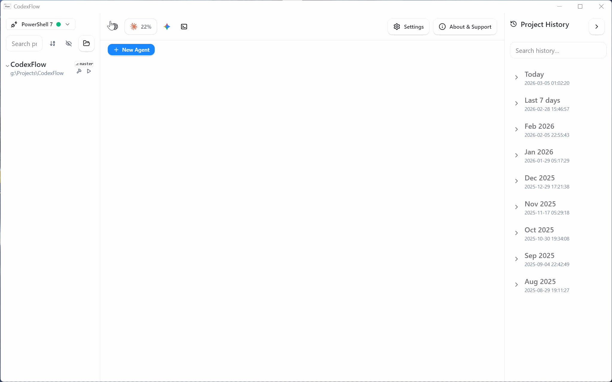
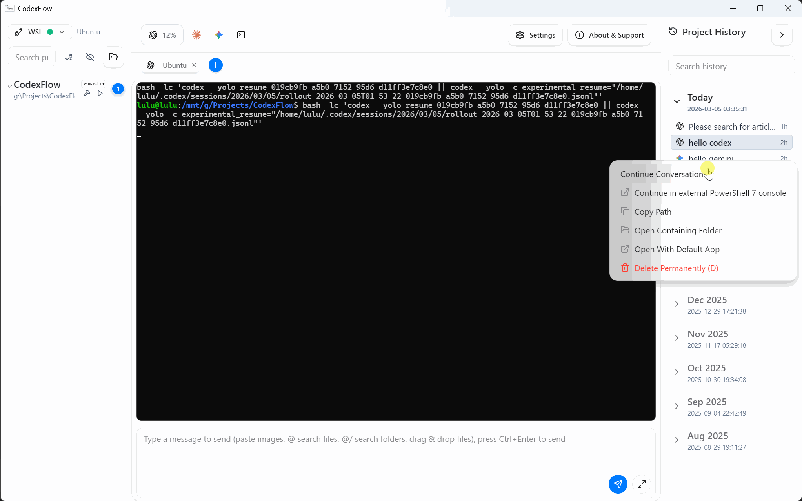
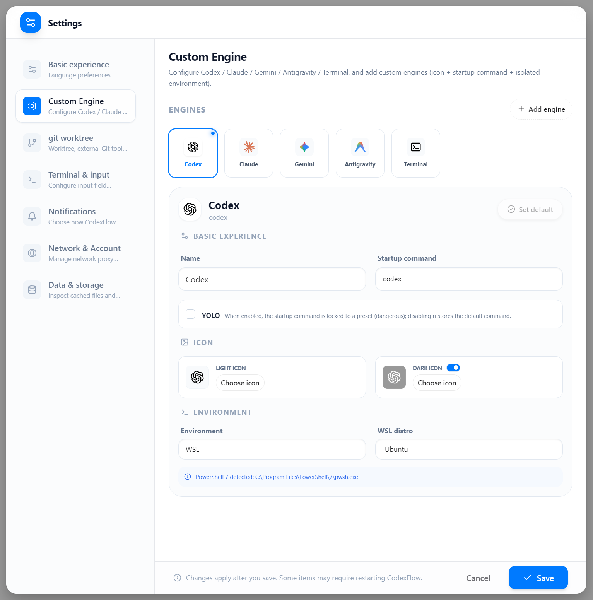

<div align="center">
<br/>

<!-- Badges -->
<a href="https://github.com/lulu-sk/CodexFlow/stargazers"></a>
<a href="https://github.com/lulu-sk/CodexFlow/releases"></a>


<a href="./LICENSE"></a>

</div>

<br/>

| 简体中文 | [English](./README.md) |
| --- | --- |

# CodexFlow

> 为 **AI 编程代理** 打造的"统一工作台"——一键切换 **Codex / Claude / Gemini / Antigravity CLI**（及自定义引擎），按**项目目录**组织会话与历史，通过 **Git Worktree** 并行多任务，用完整 **Git 面板**审查代码，Markdown 渲染浏览与继续历史对话，并为 CLI 提供图形输入框，支持**粘贴图片 / 拖拽文件 / @项目文件 / 全屏输入**，让 Prompt 编写更高效。

- 平台建议：**Windows 11 + WSL** 与 **Windows 11 + PowerShell 7** 都推荐。
- 项目结构：**UI 宿主与最小终端桥接**(Electron + React + Vite + node-pty + xterm)。

---

## 目录

- [核心特性](#-核心特性)
- [界面一览](#-界面一览)
- [快速开始](#-快速开始)
- [使用小贴士](#-使用小贴士)
- [开发与构建](#-开发与构建)
- [多语言(i18n)](#-多语言i18n)
- [目录结构(摘要)](#-目录结构摘要)
- [运行时要点与索引](#-运行时要点与索引)
- [验证步骤](#-验证步骤建议自检)
- [安全与路径](#-安全与路径)
- [诊断与日志](#-诊断与日志)
- [交流与贡献](#-交流与贡献)
- [许可证](#-许可证)
- [资源与约定](#-资源与约定可直接复制)

---

## ✨ 核心特性

1. **多引擎统一工作台（Codex / Claude / Gemini / Antigravity CLI / Terminal + 自定义引擎）**
   顶栏一键切换引擎；内置引擎支持**用量展示**与**完成通知**（任务栏徽标/系统通知/提示音）。每个引擎可独立配置**启动命令**（`codex`、`claude`、`gemini`、`agy` 或自定义命令）、**亮/暗图标**与**运行环境**（WSL / PowerShell 7 / Windows PowerShell / CMD / 指定 WSL 发行版），并支持自定义引擎扩展。
2. **跨引擎历史中心**
   只读增量索引多引擎（Codex / Claude / Gemini / Antigravity CLI）原生会话记录（Windows + WSL 路径全读取），按项目目录聚合展示，可一键新增会话；支持筛选、快速搜索与时间分组预览。详情页支持 **Markdown 渲染**（代码高亮）与**页内查找高亮**，高效历史记录查询。
3. **原生 Git worktree 并行工作流（为并行 Agent 设计，推荐用法）**
   以分支为入口（分支徽标 `⎇`）一键创建/复用 worktree：支持**单**或**多引擎（Codex / Claude / Gemini / Antigravity CLI）混合并行工作**（并发进度面板、取消、回滚清理）。完成后支持一键回收，形成“创建 → 运行 → 合并 → 清理”的闭环。
4. **完整 Git 面板：审查、提交与历史**
   不离开 CodexFlow 就能处理本地改动：查看左右对比差异、精确暂存、编写提交、拉取/获取/推送、检查分支与 worktree、浏览提交图谱，并查看提交详情中的变更文件和补丁上下文。它能把 Agent 产出的改动变成清晰的“审查 → 提交”流程，而不是一堆终端命令。
5. **为 CLI 提供图形输入框：@文件 / @规则 / 图片 / 拖拽**
   输入框支持**粘贴图片（内联预览）**、拖拽文件/目录、`@` 快速选择项目文件/目录；**AGENTS.md / CLAUDE.md / GEMINI.md** 支持快捷编辑与引用；支持全屏展开编辑，适配长 Prompt。
6. **一键继续历史会话**
   兼容不同 CLI 的继续策略；处理 WSL/Windows 路径差异；支持在应用内或外部控制台一键继续对话。
7. **引擎完成通知**
   系统通知、提示音、任务栏徽标与项目定位打通：引擎完成后可直接回到对应项目与标签页，不错过完成消息。
8. **用量与账号管理**
   顶栏实时监控各引擎配额/用量；支持多账号配置与快速切换（按引擎维度独立管理历史与会话）。
9. **高完成度体验与深度可定制**
   亮/暗/跟随系统主题；终端字体、主题与滚动条等外观定制；项目排序/隐藏/拖拽分组与备注名；网络代理支持。

------

## 🖼️ 界面一览

### 1) 总览（引擎切换 + 项目标签 + 历史入口）


### 2) Git worktree 工作流（创建 / 并行 / 合并回收）


### 3) 历史中心（分页 + Markdown 渲染 + 搜索高亮）


### 4) 一键继续 + 输入增强（@文件/@规则 + 拖拽 + 粘贴图片）


### 5) Git 面板（改动、差异、分支、提交日志、提交详情）


### 6) 设置与引擎（Codex、Claude、Gemini、Antigravity CLI、自定义引擎）


---

## 🚀 快速开始

### 环境准备
- 推荐 **Windows 11 + WSL** 或 **Windows 11 + PowerShell 7**。
- 至少有一个 AI 编程代理 CLI 可在 WSL 或 PowerShell 中运行（例如 `codex`、`claude`、`gemini` 或 Antigravity CLI `agy`）。

### WSL 环境准备教程
- [在 Windows 安装 WSL(Ubuntu)并在 WSL 安装 Codex CLI](./docs/setup-wsl-codex.zh-CN.md)

### 安装
- 若仓库已有发布版本,请前往 **[Releases](https://github.com/lulu-sk/CodexFlow/releases)** 下载最新安装包。
- 若暂无发布,可按下文"开发与构建"在本地打包。

### 初次使用
1. 点击界面右上角的 **设置**（齿轮）配置执行环境：选择 **WSL / PowerShell 7 / Windows PowerShell / CMD**，需要 WSL 时指定正确的发行版后保存。
2. 在顶部栏选择所需引擎（Codex / Claude / Gemini / Antigravity CLI / Terminal / 自定义）。
3. 选择(或添加)一个项目目录,点击 **+** 新建会话。
4. 在终端中登录或使用 API 凭据,按需完成初始设置。
5. 在输入框中粘贴图片、@项目文件、@规则文件、拖拽文件,开始你的对话与协作。

---

## 🧪 使用小贴士
- **历史一键继续**：在历史列表中选中任意对话,点击"继续"以延续上下文——所有引擎均支持。
- **历史筛选与复制**：支持筛选并直接复制所见内容,历史支持 Markdown 渲染方便阅读。
- **输入增强**：粘贴图片自动内联预览；使用全屏模式编写长 Prompt。
- **Git 面板**：Agent 改了什么先看清楚，再选择要提交的内容；分支历史、提交信息和推送都能在同一个面板里完成。
- **Worktree 工作流**：从项目侧边栏创建 worktree,并行运行 Agent,然后将成果合并回基分支。
- **多项目切换**：左侧项目区显示活跃会话数,利于多任务掌控。
- **多实例(Profile)**：先在设置里开启"实验性功能"(需重启),之后可直接再次启动应用实现多开；如需固定 profile,可使用 `--profile <name>`(如 `CodexFlow.exe --profile work`)。
- **键盘快捷键**：悬停列表项可查看可用快捷键；弹窗支持键盘操作。

---

## 🛠️ 开发与构建

### 开发环境
- Node.js ≥ 18
- 已安装 WSL,并具备发行版(默认 `Ubuntu-24.04`)

### 启动开发
```bash
# 安装依赖(会编译 Electron 主进程并重建原生模块)
npm i

# 同时启动 Vite(web)与 Electron(主进程)
npm run dev
# 开发时,主进程会从 DEV_SERVER_URL=http://localhost:5173 加载页面
```

### 生产构建

```bash
# 等价于：npm run build:web && electron-builder
npm run build
```

* 构建前的 `postinstall` 会将主进程编译到 `dist/electron`,并重建原生模块(如 `node-pty`)。
* Windows 可执行 `build-release.bat`(传入 `skip-install` 可跳过重新安装依赖)。
* 若更新了 `/electron/*` 源码,请重新执行 `npm i` 或手动运行 `npx tsc -p tsconfig.json` 以刷新 `dist/electron`；如 `node-pty` 报 ABI 不匹配,可运行 `npm run postinstall` 以重建原生依赖。
* 原生模块 ABI 会自动切换：`npm run test` 会为 Node 准备 `better-sqlite3`，Electron 开发命令会恢复 Electron 兼容的原生模块。

### 常用脚本

```bash
npm run test        # 准备 Node ABI 并使用 Vitest 执行单元测试
npm run i18n:report # 检查与英文基线的语言键差异
npm run i18n:check  # CI 使用的严格语言键校验
```

---

## 🌐 多语言(i18n)

* 技术栈：**i18next + react-i18next + ICU**；命名空间按模块拆分：`common`、`settings`、`projects`、`terminal`、`history`、`at`。
* 组件内示例：

```ts
import { useTranslation } from 'react-i18next'
const { t } = useTranslation('settings')
t('settings:language.label')
```
* 资源目录：`web/src/locales/<lng>/<namespace>.json`
* 切换语言：设置页"界面语言",或在 DevTools 中执行 `await window.host.i18n.setLocale('zh')`

### 扫描与校验

```bash
# 报告与英文基线(en)的键差异
npm run i18n:report

# 严格校验缺失键(CI 使用)
npm run i18n:check
```

* 通过环境变量 `BASE_LNG=xx` 指定基线语言(默认 `en`)。
* 若某键缺失,会回退到 `en`,且避免渲染空字符串(`returnNull/returnEmptyString=false`)。

### 外置语言包(无需改代码亦可自定义)

* Windows：`%APPDATA%/codexflow/locales/<lng>/<namespace>.json`
例：`C:\Users\you\AppData\Roaming\codexflow\locales\ja\common.json`
* WSL：`/mnt/c/Users/you/AppData/Roaming/codexflow/locales/ja/common.json`

> 设置页语言列表会自动合并"打包内语言"与"用户目录语言"；用户目录优先级更高,可用于本地覆盖。

---

## 📁 目录结构(摘要)

```
/electron/
  main.ts
  preload.ts
  pty.ts
  wsl.ts                        # Windows/WSL 路径与发行版工具
  i18n.ts                       # 主进程语言状态与 IPC 桥
  history.ts                    # 历史读取(JSONL)
  indexer.ts                    # 历史索引器(增量缓存 + 监听)
  fileIndex.ts                  # 文件/目录索引(ripgrep + chokidar)
  notifications.ts              # 系统通知管理
  storage.ts                    # 应用数据与缓存管理
  debugConfig.ts                # 统一调试配置(debug.config.jsonc)
  security/
    rendererHeaders.ts          # CSP 与安全响应头
  git/
    exec.ts                     # Git 命令执行封装
    worktreeOps.ts              # Worktree 创建/回收/删除
    worktreeCreateTasks.ts      # 并发创建任务
    worktreeRecycleTasks.ts     # 合并回收任务
    worktreeStateSnapshot.ts    # 事务化状态快照
  codex/
    bridge.ts                   # Codex CLI 桥接(认证、用量、频率限制)
    authBackups.ts              # 多账号备份与切换
    config.ts                   # Codex config.toml 管理
  antigravity/
    usage.ts                    # Antigravity CLI 用量快照探测
    notifications.ts            # Antigravity 完成通知支持
  agentSessions/
    antigravity/                # Antigravity CLI 会话发现与解析
    claude/                     # Claude 会话发现与解析
    gemini/                     # Gemini 会话发现与解析
  providers/
    runtime.ts                  # 引擎运行时解析
  projects/
    index.ts                    # 统一入口(默认 fast 实现)
  stores/
    dirTreeStore.ts             # 目录树持久化
    worktreeMetaStore.ts        # Worktree 元数据持久化
    buildRunStore.ts            # Build/Run 配置持久化
/web/
  index.html
  src/
    App.tsx
    main.tsx
    index.css
    boot/theme-bootstrap.ts     # 主题预加载(消除首帧闪烁)
    i18n/setup.ts
    adapters/TerminalAdapter.tsx
    features/
      git/                      # Git 面板：改动、分支、提交图谱、更新流程
      settings/settings-dialog.tsx
      history/
        renderers/history-markdown.tsx   # Markdown + Shiki 渲染
        find/history-find.ts             # 页内搜索高亮
    components/
      topbar/
        provider-switcher.tsx            # 引擎切换器
        codex-status.tsx                 # Codex 用量面板
        claude-status.tsx                # Claude 用量面板
        gemini-status.tsx                # Gemini 用量面板
        antigravity-status.tsx           # Antigravity 用量面板
      ui/*
    lib/
      providers/                # 引擎定义与 YOLO 预设
      theme.ts                  # 主题管理
      font-utils.ts             # 字体枚举与检测
      engine-rules.ts           # 规则文件路径解析
      shell.ts                  # Shell 命令构建器
      dir-tree-dnd.ts           # 目录树拖拽排序
    providers/
      antigravity/commands.ts
      codex/commands.ts
      claude/commands.ts
      gemini/commands.ts
    types/host.d.ts
    vite.config.mts
/tailwind.config.js
/postcss.config.js
/package.json
/tsconfig.json
/.gitignore
/docs/
  i18n.md
  diagnostics.md
```

---

## ⚙️ 运行时要点与索引

* 发行版默认：`distro = 'Ubuntu-24.04'`
* 终端模式：`terminal = 'wsl' | 'pwsh' | 'windows' | 'cmd'`（WSL、PowerShell 7、Windows PowerShell 5 或 CMD）
* 引擎命令：每个引擎独立存储启动命令（如 `codex`、`claude`、`gemini`、`agy`），可选 YOLO 预设

* WSL：`bash -lc "<engineCmd>"`
* PowerShell 7：可用时通过 `pwsh` 执行
* Windows PowerShell / CMD：用于兼容已有 Windows 环境
* 项目路径示例：`wslPath = '/mnt/c/Users/you/code/demo'`
* 历史索引：`electron/indexer.ts` 后台增量索引所有引擎的会话并写入本地缓存；渲染端经 IPC 访问,支持分页加载
* 文件索引：`electron/fileIndex.ts` 使用 **ripgrep** 进行初次全量扫描,配合 **chokidar** 增量更新(建议将 ripgrep 放至 `vendor/bin/rg.exe`)。搜索在主进程执行以避免大仓库卡顿
* Git Worktree：`electron/git/worktreeOps.ts` 管理 worktree 生命周期并使用事务化状态快照。元数据存储在 `electron/stores/worktreeMetaStore.ts`
* Projects 模块：统一入口 `electron/projects/index.ts`,默认 `projects.fast.ts` 实现；启动时会在 `perf.log` 记录所用实现

---

## ✅ 验证步骤(建议自检)

1. 打开应用后点击"新建代理"：看到 WSL 提示/命令行输出
2. 在输入框键入 `uname -a`、`pwd` 并回车：应有回显
3. 窗口缩放：终端内容自动铺满(FitAddon 生效)
4. 切换引擎：在顶部栏选择不同引擎,验证新会话正常启动
5. 可选：从侧边栏创建 worktree,验证 Agent 在新 worktree 目录中启动
6. 可选：打开 Git 面板，确认所选项目的本地改动、差异、分支和提交历史可正常加载
7. 可选：若已安装 CLI，执行 `codex .` 或 `agy` 应能启动并输出日志

---

## 🔐 安全与路径

* 渲染进程安全：`contextIsolation: true`、`nodeIntegration: false`；所有能力经 `electron/preload.ts` 暴露的最小 API(类型定义见 `web/src/types/host.d.ts`)
* 内容安全策略(CSP)：通过 meta 标签与响应头(`electron/security/rendererHeaders.ts`)双重执行严格资源加载策略,包括 `frame-ancestors 'none'` 与 `X-Frame-Options: DENY`
* Windows/WSL 路径互转：见 `electron/wsl.ts`,支持 Windows 盘符与 `\\wsl.localhost\Distro\...` ↔ WSL 路径

---

## 🩺 诊断与日志

* 详见 `docs/diagnostics.md`

* 统一调试配置：在应用数据目录放置 `debug.config.jsonc` 即可启用逐模块诊断
* 主进程：设置环境变量 `CODEX_DIAG_LOG=1` 后写入 `%APPDATA%/codexflow/perf.log`
* 渲染端：`localStorage.setItem('CF_DIAG_LOG','1')`

---

## 🤝 交流与贡献

* 💬 Q&A / 讨论：GitHub Discussions
* 🐞 Bug / 功能请求：GitHub Issues(请附带系统信息与复现步骤,并使用模板)
* 🤲 贡献流程：详见 `CONTRIBUTING.md` 或 `CONTRIBUTING.zh-CN.md`
* 🔐 安全问题：请见 `SECURITY.md`(勿在公开 Issue 披露)
* 🔏 隐私政策：参阅 `PRIVACY.md`

欢迎 Star ⭐、PR 与翻译语言包。

---

## 📄 许可证

项目基于 **Apache License 2.0** 开源,详见仓库根目录的 `LICENSE`; 若再分发,请保留 `NOTICE` 中的附加声明。

---

## 🧾 资源与约定(可直接复制)

- 应用截图：`assets/screenshots/<feature-name>.(gif|png)`
- 品牌命名：统一使用 **CodexFlow**，不做缩写
- 引用链接：
  - 仓库：https://github.com/lulu-sk/CodexFlow
  - 发布页：https://github.com/lulu-sk/CodexFlow/releases
